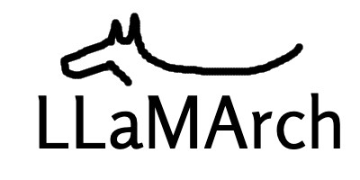

# LLaMArch

Minimal, Building Blocks for Large Language Models!

LLaMArch is a Python library that provides a set of tools and patterns for building and deploying large language models (LLMs) in a variety of domains. It is designed to be modular and extensible, allowing users to easily incorporate LLMs into their projects and customize them to specific requirements.

## Why LLaMArch?

LLaMArch stands out due to its modular and extensible design, which is not fully addressed by existing libraries. Key advantages include:

- **Design Patterns**: Common patterns and workflows are provided, allowing users to easily build and deploy LLMs in various domains.
- **Component Integration**: Combines LLMs with memory systems, agent coordination, and fine-tuning in one framework.
- **Adaptability**: Allows for customization to specific workflows and domains, unlike libraries that focus only on text generation or embeddings.
- **Support**: Provides simple interfaces for various LLM vendors and vector databases, allowing for seamless integration.
- **Extensibility**: Allows for easy addition of new components and patterns, enabling the creation of complex architectures.

## Whom to contact?

Please direct your queries to [gpavanb1](http://github.com/gpavanb1)
for any questions.

## Acknowledgements

Special thanks to discussions and the [article](https://towardsdatascience.com/generative-ai-design-patterns-a-comprehensive-guide-41425a40d7d0) by [Vincent Koc](https://medium.com/@vincentkoc) for inspiring this project.

