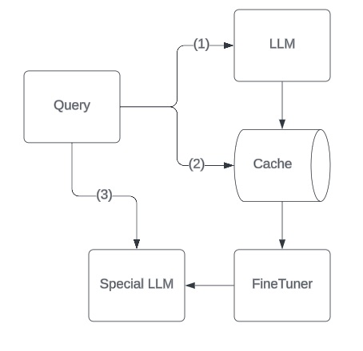

# Layered Caching

The `LayeredCaching` class is a component in the `llamarch` library that provides an interface to work with caching layers that are used to improve the performance of LLMs through fine-tuning.

::: llamarch.patterns.layered_caching