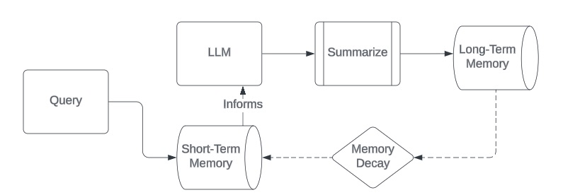

# Memory Cognition

The `MemoryCognition` class is a component in the `llamarch` library that provides an interface to work with memory cognition patterns, which involve the use of memory to improve the performance of LLMs.

::: llamarch.patterns.memory_cognition