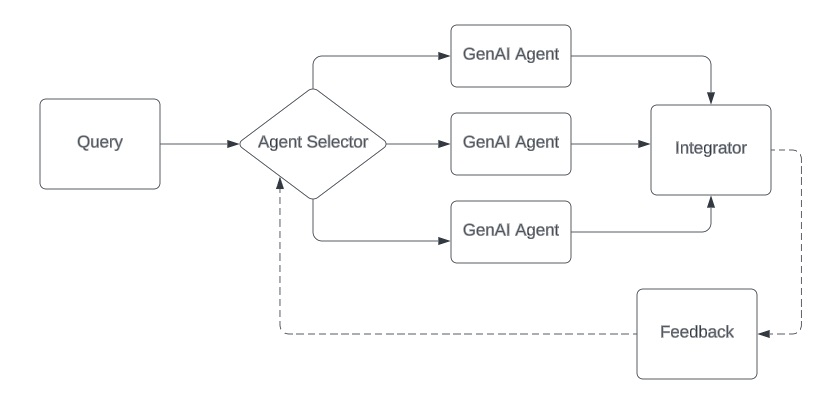

# Multi-Agent Feedback

The `MultiAgentFeedback` class is a component in the `llamarch` library that provides an interface to work with multi-agent feedback patterns, which involve the use of multiple agents to improve the performance of LLMs.

::: llamarch.patterns.multiagent_feedback