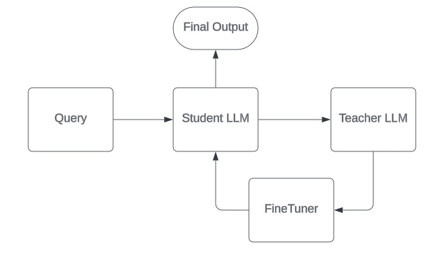

# Student-Teacher

The `StudentTeacher` class can be used to train a student model using a teacher model, that is preferably an expert in a narrow domain. The student model is trained to generate responses that are evaluated by the teacher model.

::: llamarch.patterns.student_teacher